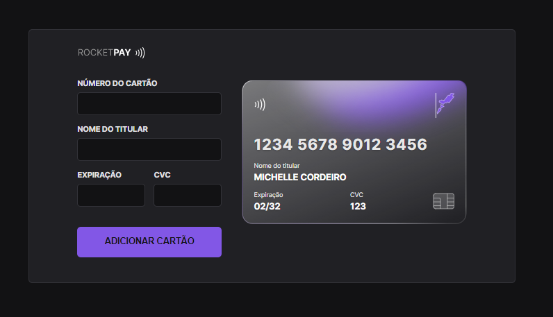

<!--Banner session-->

  
  

   

<!--About session-->
<h1 align="center" style="color: DarkViolet">Rocketpay - sistema de pagamento</h1>

Componente que simula um sistema de pagamento de cartão de crédito, desenvolvido no Explorer Lab da [RocketSeat](https://www.rocketseat.com.br/).

  <a href="#-tecnologias">Tecnologias</a>&nbsp;&nbsp;&nbsp;|&nbsp;&nbsp;&nbsp;
  <a href="#-projeto">Projeto</a>&nbsp;&nbsp;&nbsp;|&nbsp;&nbsp;&nbsp;
  <a href="#-layout">Layout</a>&nbsp;&nbsp;&nbsp;|&nbsp;&nbsp;&nbsp;
  <a href="#memo-licença">Licença</a>

  

 

  

## 🚀 Tecnologias

Esse projeto foi desenvolvido com as seguintes tecnologias:

<code></code>
<code></code>
<code></code>
<code></code>
<code></code>
<code></code>
<code></code>
<code></code>

- HTML e CSS
- JavaScript e JSON
- [Node e NPM](https://nodejs.org/)
- [Vite](https://vitejs.dev/)
- [iMask](https://imask.js.org)

## 💻 Projeto

O Rocketpay é um componente que simula o formulário de preenchimento de cartão de crédito, onde é possível adicionar máscara aos inputs e atualizar elementos HTML via DOM.

## 🔖 Layout

Você pode visualizar o layout no [repositório](https://www.figma.com/file/fNf6nTQ9rGvKV8wlbmNljG/Explorer-Lab-%2301) do meu Figma (necessário ter conta no [Figma](https://figma.com) para acessá-lo).

## :memo: Licença

Esse projeto está sob a licença MIT.

---

Baseado no código desenvolvido pela Rocketseat
